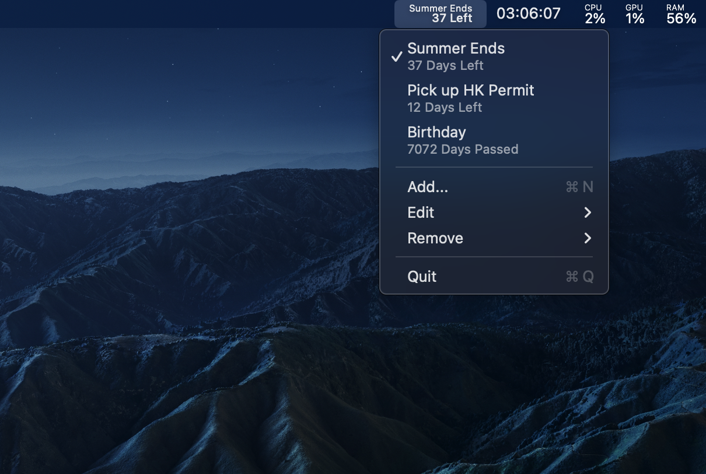

## MenuProgress



### Overview

A simple menubar progress tracking tool for Apple macOS.
Powered by Swift and Cocoa(AppKit).

### Build

Make sure you have `swiftc` and `lipo` in your `PATH`.

```sh
chmod +x build.sh
./build.sh
```

### Test

```sh
./MenuProgress.app/Contents/MacOS/MenuProgress --selftest
```

### Installation

Move `MenuProgress.app` to your `/Applications` folder.

To start it at login, add it in System Settings > General > Login Items.

### Usage

Click the menubar item:

- Click an event to show it in the menubar.
- `Add...` for a name and a target date.
- `Edit` to change the name or the date of an event.
- `Remove` to delete one, with confirmation.
- `Export...` writes all events to a JSON file,
  `Import...` reads one back and replaces the current events.

Events are stored in `UserDefaults` under `Salmonization.MenuProgress`.
The import and export format is the same list:

```json
[
  {
    "name": "JLPT",
    "date": "2026-07-05"
  }
]
```

### License

BSD 2-Clause License
